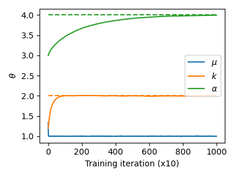

# Single particle statistical learning

Demo of how to use statistical learning to estimate the parameters of an
analytic Hamiltonian based on observational data.

## Background

This project aims to showcase the use of statistical learning to estimate the
parameters $\theta = (k, \mu, \alpha)$ for a thermal particle in a potential with
the Hamiltonian

$$
H_\theta(x) = k||x - \mu||^\alpha.
$$

To that end, we use MCMC sampling to generate samples for a known set $\theta^*
= (k, \mu, \alpha)$, which yields samples of the target distribution
$p_\mathrm{data}(x)$. This data is subsequently fed into a statistical learning
algorithm, which performs stochastic gradient descent on the loss
$$
\mathcal{L}_\theta = -\int dx \log p_\theta(x) p_\mathrm{data}(x),
$$
where $p_\theta(x)$ is the probability function of the canonical ensemble
$$
p(x) = \frac{e^{H_\theta(x)}}{Z_\theta}.
$$
The gradient to optimise is thus
$$
\partial_\theta \mathcal{L}_\theta = \langle \partial_\theta H_\theta \rangle_{p_\mathrm{data}} - \langle \partial_\theta H_\theta \rangle_{p_\theta}.
$$

Performing stochastic gradient descent on this gradient indeed results in
convergence of the parameters to $\theta^*$:



## Quick start

All code is written in the Rust programming language.

### Prerequisites

Install Rust following the recommended instructions for your specific operating
system at https://rustup.rs/.

### Running

Code is built and run with Cargo:
```bash
cargo run -r
```

Optional CUDA support for training can be enabled by running
```bash
cargo run -r --features cuda
```
instead. **Note:** Cuda support does not have any performance benefit and
exists more as a showcase at this point.

### Output

Running either command will first generate position samples of the particle by
MCMC sampling. These positions are saved in `data.npz`. Subsequently, parameter
estimation will start. The values of the three parameters for each of the
10,000 epochs will be saved to `training.npz`.
